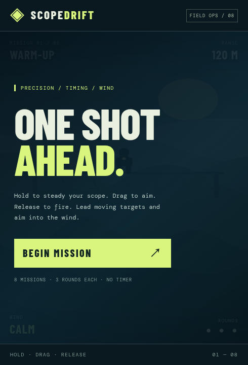

# Scope Drift

An eight-mission, touch-first sniper game for portrait mobile browsers. Hold to steady the scope, drag to aim, release to fire. Lead moving targets and aim into the wind. Three rounds per mission; no timer or ads.

[Play Scope Drift](https://k-electron-bots.github.io/scope-drift/) · [Controls and play guide](documentation/play.md)

*Live start screen captured October 2, 2026. No gameplay/accessibility acceptance is implied by the screenshot.*

Time-based target movement and high-DPI canvas rendering. No runtime dependencies or data collection in the game.

## Build or change it
[Development reference](documentation/development.md) covers commands, source layout and static hosting. `docs/` is the deployed game, not the documentation folder; guides live in `documentation/` so documentation work does not alter the game entry point.
